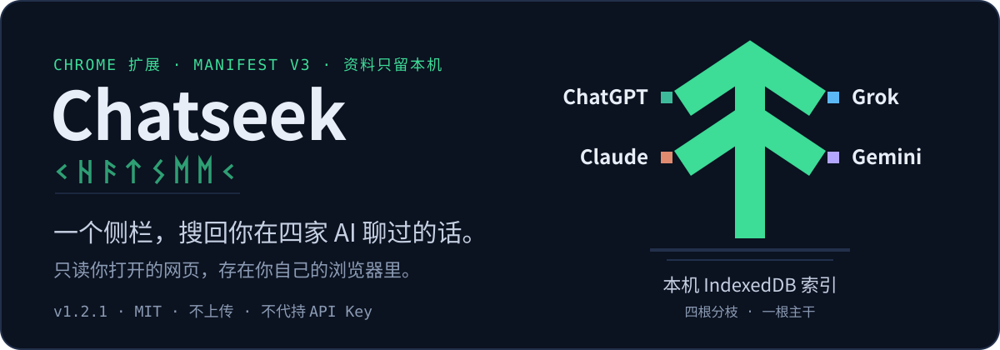
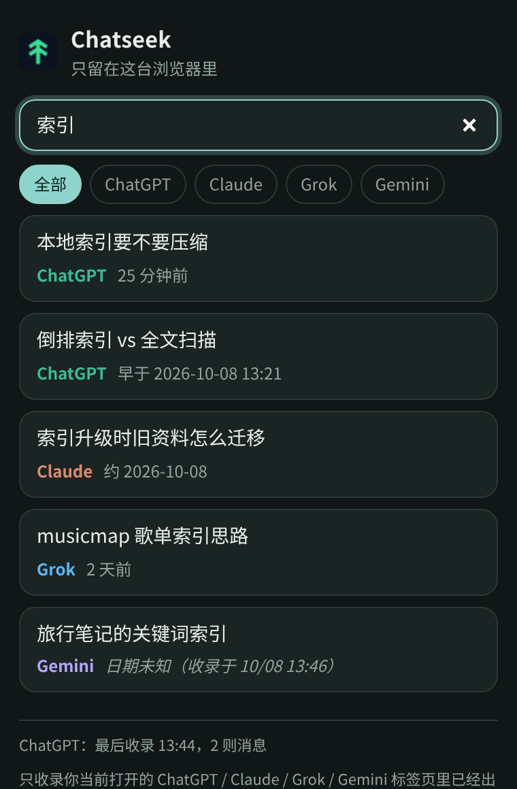
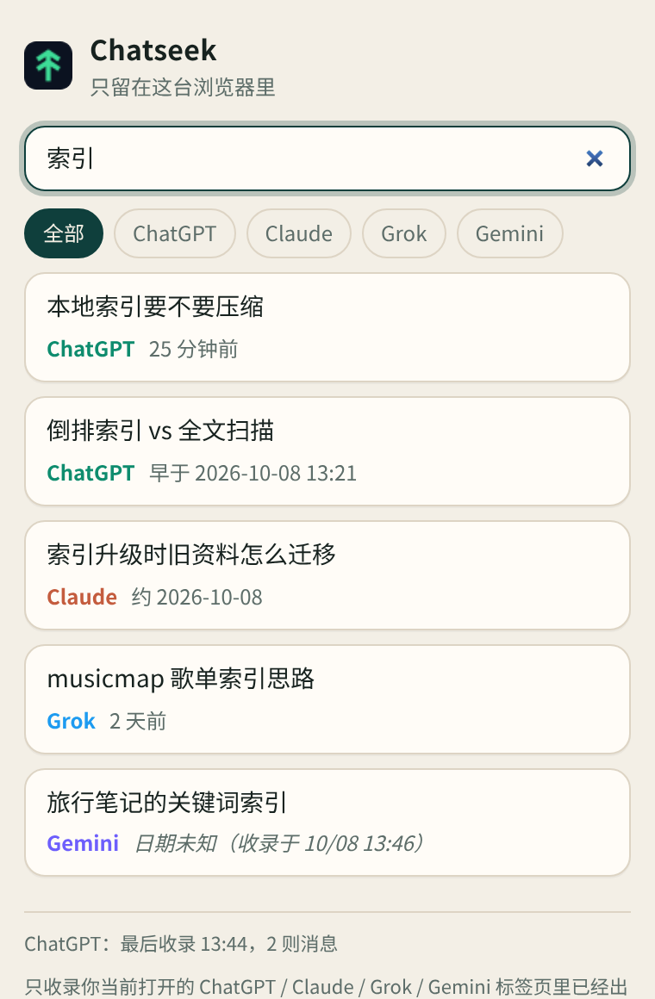
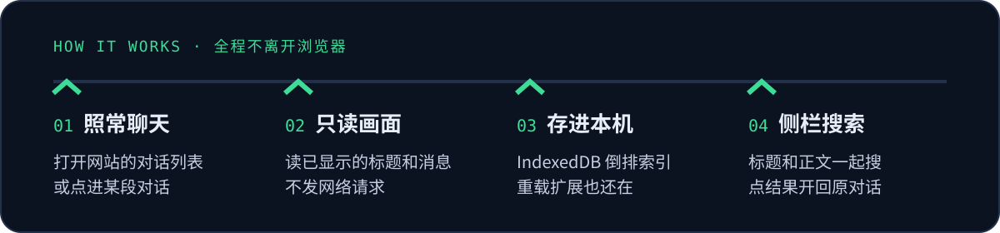

<p align="center">
  
</p>

<p align="center">
  <b>Chrome 扩展：在本地搜索你打开过的 ChatGPT / Claude / Grok / Gemini 旧聊天。</b><br>
  数据只存在你浏览器的 IndexedDB，不上传、不代持 API Key。
</p>

<p align="center">
  
  &nbsp;&nbsp;
  
</p>

<p align="center"><sub>侧栏实际界面，跟随系统深浅色。画面里是示例数据，用来展示四家来源和四种日期写法。</sub></p>

## 它做什么

你在网页上打开 ChatGPT、Claude、Grok 或 Gemini 时，Chatseek 把页面上**已经显示出来**的对话标题和消息写进本机索引。之后点工具栏图标打开侧栏，输入关键词，就能跨四家一起搜标题和正文。点标题会切回（或重新打开）原来那段对话；点「阅读」或预览，则在扩展自己的分页里看本机已经收录的全文。

- **页签从左到右**：默认停在「活跃中」（四家里还没封存的）。接着是 ChatGPT、Claude、Grok、Gemini（只看这一家、且未封存），然后是「已封存」，「全部」在最后。搜索只搜当前页签里的对话。
- **搜正文，不只搜标题**：英文和数字按完整词匹配（`musicmap` 能中，`music` 不会误中 `musicmap`），中文按单字和相邻双字建索引；多个词要出现在同一段对话里。
- **标题下有一两行预览**：没在搜索时显示你的第一条提问（没有提问就显示最后一条消息），方便认出是哪段对话。搜索时显示命中词附近的一小段，并把命中的词标出来。库里只有标题、没有正文时，会标明「仅有标题」。
- **本机阅读页**：每一行可以点「阅读」，也可以点预览。浏览器会新开一个分页，只读这台电脑 IndexedDB 里的标题、平台、日期和已收录消息，不连接四家网站。从搜索进来时，第一处命中是黄底，页顶可以上一处、下一处。页顶的「去原网站打开」才回到原来的网址（Gemini 的 `/u/数字/` 会保留）。聊天文字按纯文本显示，不会当成网页去执行。
- **当前这段对话有绿框**：侧栏里正在打开的那一行用绿色边框标出，换标签或在页面里点进另一段会跟着走。
- **封存仍可搜**：页面上明确标成已封存的对话留在索引里，带灰色「已封存」标签。目前只有 ChatGPT 有这种明确标记（封存列表，或打开后的封存横幅／取消封存按钮）。从侧栏消失不会改状态，也不会自动删。之后又在未封存的页面上看到，会恢复成活跃。
- **从索引移除**：每一行都可以在确认后，从这台浏览器的索引里删掉这一段（对话、消息、倒排索引一起删）。网站上的聊天不动。网站侧栏里还列着它也不会被加回来；以后在网站上再打开这一段，才会重新收进来。
- **按最后活动时间排**：日期尽量取对话的最后活动时间，不拿收录时间冒充，规则见下方「侧栏日期怎么读」。
- **收不到会提示**：对话页连续约 8 秒一条消息都没读到时，侧栏底部会提示「页面可能改版」，工具栏图标出现「!」。
- **界面语言**默认跟随浏览器，侧栏右上角也可以手动切换，选择会记在这台浏览器里。内置繁体中文、简体中文、English、日本語、한국어、español、français、Deutsch、português（巴西）。日期用该语言的 `Intl` 格式；「约」「早于」「日期未知」也会跟着翻。扩展在 `chrome://extensions` 上的名称和说明跟随浏览器语言。

## 原则：只读、不打接口、资料留本机

<p align="center">
  
</p>

- **只读页面**：内容脚本只读当前标签页里已经渲染出来的对话列表和消息，不挂 fetch / XHR，也不请求各家网站的内部接口（Gemini 的 `batchexecute` 也不碰）。
- **资料留本机**：索引存在这个浏览器的 IndexedDB，扩展本身不发任何网络请求。`npm run verify` 会挡掉代码里的 `fetch(`、`sendBeacon`、`WebSocket`、`EventSource`。
- **权限只到这几个网站**：`chatgpt.com`、`chat.openai.com`、`claude.ai`、`grok.com`、`www.grok.com`、`grok.x.com`、`x.ai`、`gemini.google.com`，外加 `sidePanel`。侧栏手动选的语言记在侧栏页面自己的 `localStorage` 里，不需要额外权限。不要求 `<all_urls>`，不要求 API Key。
- **不收临时聊天**：ChatGPT 网址带 `temporary-chat=true` 的临时聊天不收录。
- **随时清空**：侧栏底部「清除本地索引」会删掉这台浏览器里 Chatseek 的全部数据，网站上的聊天不受影响。

## 安装（加载已解压的扩展程序）

目前还没上架 Chrome Web Store，先用开发者模式安装：

1. 下载本仓库（`git clone` 或 Download ZIP 后解压）。
2. 打开 `chrome://extensions`，打开右上角「开发者模式」。
3. 点「加载已解压的扩展程序」（Load unpacked），选仓库目录。
4. 把已经开着的 ChatGPT、Claude、Grok、Gemini 标签页刷新一次。

需要 Chrome 116 以上（Manifest V3 + Side Panel）。更新代码后在扩展页点「重新加载」，再刷新一次网站标签页，内容脚本才会换成新版；本地索引不会因此清空。

## 怎么用

1. 打开 chatgpt.com、claude.ai、grok.com 或 gemini.google.com，浏览对话列表，点进你想以后搜得到的对话。
2. 点工具栏的 Chatseek 图标打开侧栏，输入关键词。
3. 用上方页签看活跃、某一家、已封存或全部。搜索框只搜当前页签。点标题回到原对话。点「阅读」或预览，在新分页里看本机收录的内容。每一行的「从索引移除」只删本机这一条，要先确认。

很长的对话只会收已经画在页面上的消息；想多收，就在那段对话里往上滚。

## 侧栏日期怎么读

日期表示**这段对话的最后活动时间**（页面上的真实会话时间）。拿不到确切时间时，Chatseek 会照实写出它知道多少；只有完全推不出来时，括号里才是采集时间：

| 侧栏显示 | 意思 |
| --- | --- |
| 25 分钟前／2 天前／2026-09-30 | 确切时间：页面上本来就有，或你刚在开着的标签页里发了新消息。 |
| 早于 2026-10-08 13:19 | 自己没有时间，但排在一条确切时间下面，所以一定比它旧。这个时间不会随「现在」漂移。 |
| 约 2026-10-08 | 网站侧栏的分组（Today、Yesterday、Previous 7 Days），只到日期。 |
| 日期未知（收录于 10/08 13:44） | 推不出来。括号里是收进索引的时间，不是对话时间。 |

排序跟网站自己的侧栏一致，越上面越新。比较准的时间不会被比较粗的估计盖掉。四家共用同一套规则，细节见 [`notes/CHANGELOG-1.2.1.md`](notes/CHANGELOG-1.2.1.md)。

## 四家支持状态

| 平台 | 收录内容 | 实机验证 |
| --- | --- | --- |
| ChatGPT | 对话列表、对话正文、页面时间 | 早期版本测过收录和搜索；1.2.x 待实机复测 |
| Grok | 对话列表、对话正文、页面时间 | 早期版本测过收录和搜索；1.2.x 待实机复测 |
| Claude | 对话列表、对话正文、页面时间 | **尚未实机验证** |
| Gemini | 对话列表、对话正文（含多账号 `/u/N/` 网址） | **尚未实机验证**：选择器按公开页面结构写成，第一次实机可能还要修一轮 |

自动化测试用离线 HTML 样本跑 ChatGPT 和 Gemini 的收录，不登录任何账号。

## 已知限制

- **没打开过的旧聊天搜不到。** 只收你在标签页里看过、或出现在网站侧栏里的对话；还不能导入官方导出文件。
- **只收已渲染的消息。** 长对话要往上滚，较早的消息才会进索引。
- **Gemini 页面上没有时间。** 没在开着的标签页里发过新消息的 Gemini 对话，大多会显示「日期未知」。
- **网站改版会让收录失效。** 健康提示能发现「对话页一条消息都没读到」，但选择器要靠更新修。
- **搜索是整词，不做词干。** `music` 不会命中 `musicmap`。阅读页的黄底用同一套规则。
- **阅读页只显示已经收录的消息。** 没在网页上滚到的更早内容不会出现。它不把文字排成完整 Markdown，只保留换行，并把三个反引号围起来的代码块用等宽字显示。1.5.0 之前就收进来、之后没再打开过的对话，消息顺序按收录时间；再打开一次原对话后，会按页面顺序排。
- **封存标记目前只有 ChatGPT。** Claude 的普通对话、Grok、Gemini 页面上没有可靠的「这段已封存」横幅或封存列表，所以这三家不会被标成已封存。侧栏里消失不等于封存。ChatGPT 的措辞或 DOM 若改了，检测会停下来，不会凭猜测去标。

## 范围

- 做：ChatGPT、Claude、Grok、Gemini；本地存储；本地搜索。
- 不做：Perplexity、DeepSeek；代持 API Key；一次导入全部历史。

## 开发

```bash
npm install
npm run verify        # manifest、权限、禁用网络调用检查 + ChatGPT 样本
npm run test:search   # 搜索、日期、预览、侧栏、封存、语言、阅读页
npm run test:fixture  # ChatGPT / Gemini 离线样本
npm run test:gemini   # Gemini 收录到 IndexedDB 全流程
```

当前版本 1.5.0。版本记录在 [`notes/`](notes/)：[`CHANGELOG-1.1.0.md`](notes/CHANGELOG-1.1.0.md)（ChatGPT 收录与最后活动时间）、[`CHANGELOG-1.2.0.md`](notes/CHANGELOG-1.2.0.md)（Gemini）、[`CHANGELOG-1.2.1.md`](notes/CHANGELOG-1.2.1.md)（日期显示）、[`CHANGELOG-1.3.0.md`](notes/CHANGELOG-1.3.0.md)（预览、当前对话绿框、简体「条消息」）、[`CHANGELOG-1.4.0.md`](notes/CHANGELOG-1.4.0.md)（封存、页签、九种语言）、[`CHANGELOG-1.5.0.md`](notes/CHANGELOG-1.5.0.md)（本机阅读页）。侧栏预览的示例截图：[`docs/panel-1.3.0-idle.png`](docs/panel-1.3.0-idle.png)、[`docs/panel-1.3.0-search.png`](docs/panel-1.3.0-search.png)。1.4.0 页签、封存标签、移除确认和语言切换：[`docs/panel-1.4.0-active.png`](docs/panel-1.4.0-active.png)、[`docs/panel-1.4.0-archived.png`](docs/panel-1.4.0-archived.png)、[`docs/panel-1.4.0-remove.png`](docs/panel-1.4.0-remove.png)、[`docs/panel-1.4.0-en.png`](docs/panel-1.4.0-en.png)、[`docs/panel-1.4.0-ja.png`](docs/panel-1.4.0-ja.png)。1.5.0 阅读页（示例数据）：[`docs/reader-1.5.0-hit.png`](docs/reader-1.5.0-hit.png)、[`docs/reader-1.5.0-title-only.png`](docs/reader-1.5.0-title-only.png)、[`docs/reader-1.5.0-archived.png`](docs/reader-1.5.0-archived.png)、[`docs/panel-1.5.0-read.png`](docs/panel-1.5.0-read.png)。画面里是示例数据；「封存的读书笔记」那一行是写进示例索引的，不是 Claude 被检测成已封存。

## License

[MIT](LICENSE)
